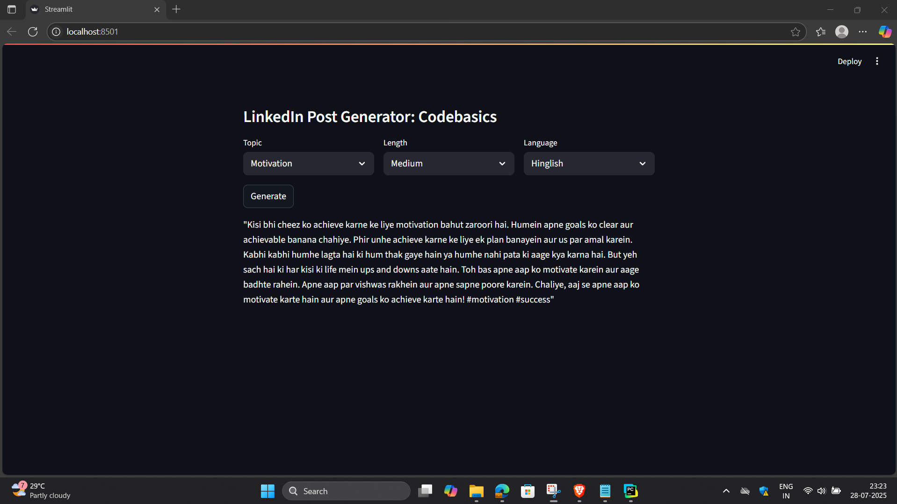

# 🚀 LinkedIn Post Generator using Streamlit and OpenAI (Groq API Compatible)

This project generates **LinkedIn posts** based on a **selected topic, language, and length** using **Streamlit for the UI** and **OpenAI/Groq API for text generation**.

---

## ✅ Features
✔ Select a topic from predefined categories  
✔ Choose post length (**Short**, **Medium**, **Long**)  
✔ Choose language (**English** or **Hinglish**)  
✔ Generates engaging **LinkedIn-style posts instantly**  

---

## 🛠 Tech Stack
- **Python 3.x**  
- **Streamlit** – For building the web app  
- **OpenAI / Groq API** – For generating posts  
- **Custom Python scripts** (`few_shot.py`, `post_generator.py`)  

---

## 📂 Project Structure
```
LinkedIn-Post-Generator/
│
├── main.py             # Main Streamlit app
├── few_shot.py         # Contains FewShotPosts class for tags/topics
├── post_generator.py   # Contains function to generate posts using API
├── requirements.txt    # All dependencies
|-~~.env                #For the Groq Key
└── README.md           # Project documentation
```

---



## 🔑 Add API Key
In this project, we used **Groq API** (easy to use & free).  
Create a file named **`.env`** in the project root and add:
```
OPENAI_API_KEY=your_api_key_here
```

Install `python-dotenv` to load environment variables:
```bash
pip install python-dotenv
```

---

## ▶️ Run the App
Use:
```bash
python -m streamlit run main.py
```

After running, Streamlit will show:
```
Local URL: http://localhost:8501
```
Open it in your browser.

---

## 📜 How It Works
### **1. `main.py`**
- Creates the **UI** using **Streamlit**
- Dropdowns for:
  - ✅ **Topic** → fetched from `FewShotPosts.get_tags()`
  - ✅ **Length** → `Short | Medium | Long`
  - ✅ **Language** → `English | Hinglish`
- On **Generate** button click → calls `generate_post()`

---

### **2. `few_shot.py`**
Contains the `FewShotPosts` class which holds example topics:
```python
class FewShotPosts:
    def __init__(self):
        self.tags = ["AI", "Tech Careers", "Startups", "Productivity"]

    def get_tags(self):
        return self.tags
```

---

### **3. `post_generator.py`**
Uses **OpenAI/Groq API** to generate posts:
```python
import openai
import os
from dotenv import load_dotenv

load_dotenv()
openai.api_key = os.getenv("OPENAI_API_KEY")

def generate_post(length, language, topic):
    prompt = f"Write a {length} LinkedIn post in {language} about {topic}."
    response = openai.Completion.create(
        engine="text-davinci-003",
        prompt=prompt,
        max_tokens=200
    )
    return response.choices[0].text.strip()
```

---

## 🚀 Deployment
You can deploy this app on:
- ✅ **Streamlit Cloud** → [https://share.streamlit.io](https://share.streamlit.io) For run - streamlit run main.py
- ✅ **Render** or **Heroku** for free hosting

---

## ✅ Example Usage
- **Topic:** AI  
- **Length:** Medium  
- **Language:** English  

Click **Generate**, and you’ll get something like:
```
AI is transforming industries at lightning speed. Here’s why you should stay ahead...
```

---

## 📌 Notes
- ✅ Make sure you have **API Key** (OpenAI or Groq)
- ✅ Internet connection is required
- ✅ For large requests, you may need **billing enabled** for OpenAI  

---

### ⭐ If you like this project, give it a star on GitHub!  
